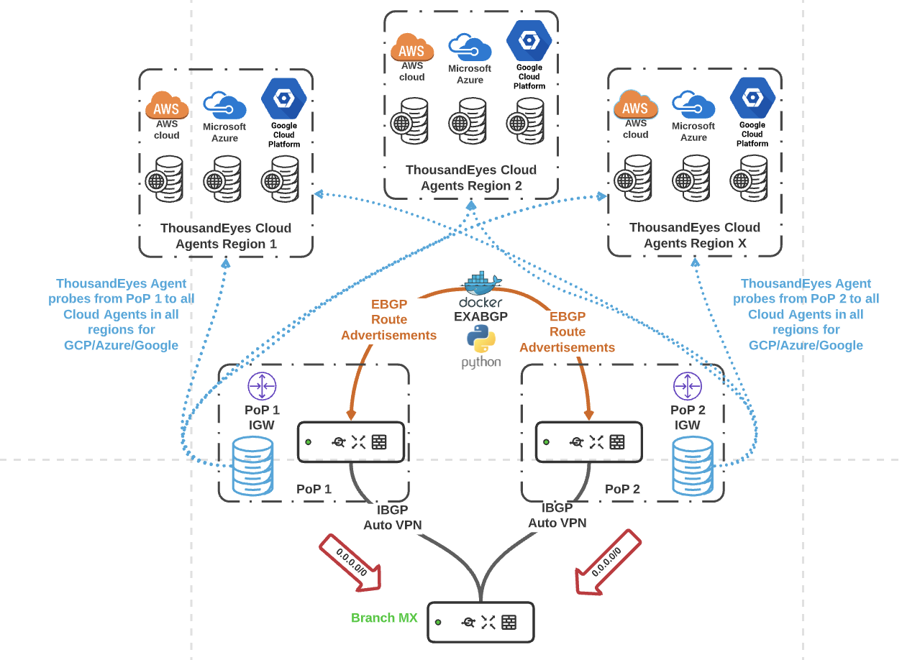

# exabgp Route Reflector

This route reflector is used to steer branch traffic from SD WAN nodes to the best performing DC where a MX/vMX is being hosted. EXABGP is used to manipulate BGP advertisements based on test data probing hosted ThousandEyes cloud agents across all regions in GCP/Azure/AWS. 

Below is a Diagram that reflects high level the operational flow of the solution:



In the above solution both PoPs have their own NAT Gateways out to the internet. In the below examples we utilize Cisco Meraki vMXs deployed from the AWS Marketplace along with an ubuntu VM running the Docker Container. EXABGP advertises specific SaaS prefixes obtained from the following URLs:

AWS Prefixes json: https://ip-ranges.amazonaws.com/ip-ranges.json

GCP Prefixes json: https://www.gstatic.com/ipranges/cloud.json

Azure Prefixes json: https://download.microsoft.com/download/7/1/D/71D86715-5596-4529-9B13-DA13A5DE5B63/ServiceTags_Public_20210104.json

And these prefixes are mapped to the results of the ThousandEyes Agent to Agent tests from PoP 1/2 to all AWS/Azure/GCP ThousandEyes Cloud Hosted Agents. (For this test we tested reachability to all regions which equated to 114 endpoints across all the public clouds)

Routes advertised from the exabgp process are then propagated via EBGP to the Cisco Meraki vMXs sitting in different VPCs in different regions (US West and US East). Underlying connectivity has been configured with VPC peering between the EXABGP VPC and the vMXs in their respective regions. VPC peering is outside the scope of this solution as this architecture can apply to any cloud/colo/DC IP fabric. 

Below are screenshots showing the underlying vMXs that have been deployed to AWS in their respective regions along with their site to site VPN config and screenshots of the Meraki API to fetch and configure BGP information.

Note:
For more information on deploying virtual MXs from the AWS marketplace please reference the following link:
https://documentation.meraki.com/MX/MX_Installation_Guides/vMX_Setup_Guide_for_Amazon_Web_Services_(AWS)

BGP Settings for Both vMXs:


AWS East vMX:

AWS West vMX:

Additionally, we have deployed a ubuntu server VM to host the Docker Container. For more information on deploying Ubuntu Servers from the AWS Marketplace please reference:
https://aws.amazon.com/marketplace/pp/Canonical-Group-Limited-Ubuntu-1804-LTS-Bionic/B07CQ33QKV

Once the linux instance is deployed you can SSH into the Ubuntu Box. For more information on SSHing into you linux server please reference:
https://docs.aws.amazon.com/AWSEC2/latest/UserGuide/AccessingInstancesLinux.html

Below is the output from the Ubuntu server showing the IPv4 information: (ifconfig)

Once the Ubuntu VM has been deployed and you can verify basic internet connectivity with the instance the next step is to disable the source/destination check for the EC2 instances (if this was not already done for the vMXs as well). To do this please follow the below instructions:

To change source/destination checking for a network interface using the console

1) Open the Amazon EC2 console at https://console.aws.amazon.com/ec2/.

2) In the navigation pane, choose Network Interfaces.

3) Select the network interface and choose Actions, Change Source/Dest Check.

4) In the dialog box, choose Enabled (if enabling) or Disabled (if disabling), and Save.

More information can be found here on ENIs: https://docs.aws.amazon.com/AWSEC2/latest/UserGuide/using-eni.html

# Installing Docker on Ubuntu Server

For installing Docker on Ubuntu server please reference:
https://docs.docker.com/engine/install/ubuntu/

The server in the referenced solution below was installed using the convenience script: (run as root)

```
$ curl -fsSL https://get.docker.com -o get-docker.sh
$ sudo sh get-docker.sh
```

# Pulling Docker EXABGP image from Docker Hub

Luckily Pierky (Fellow Cisco member) made it easy for us to package the exabgp image. Below is a link to the dockerhub page:
https://hub.docker.com/r/pierky/exabgp

In order to move the image from Docker Hub to the Ubuntu Server you need to initiate a docker pull command. More information on docker pull can be found here:
https://docs.docker.com/engine/reference/commandline/pull/

```
docker pull pierky/exabgp
```
# Executing the Container

Put the ExaBGP startup config into exabgp/exabgp.conf...

1) mkdir exabgp
2) vim exabgp/exabgp.conf
... then run the image in detached mode (-d) with the local exabgp directory mounted in /etc/exabgp:

```
docker run -p 179:179 --network host -it -v /home/ubuntu/exabgp:/etc/exabgp:rw pierky/exabgp
```
You can verify that log gets populated: cat exabgp/log.

Run docker ps to get the running container's ID (cd61079342d2 in the example below), then use it to possibly attach a terminal to the running instance.

Additional note: --network host has been added to the docker run command to facilitate IP connectivity from the host (kernel) interface that is the eni in the VPC. More information on the --network host option can be found here:
https://docs.docker.com/network/host/


# Additional Solution Pre-Requisites

The NAT Gateways at each PoP have routes pointing to branch subnets with their local vMX/MX local IP as the next hop. 

Default routes either generated from exabgp with the next hop as the local NAT Gateway. (This can be done on the Cisco Meraki MX/vMX in concentrator mode by adding 0.0.0.0/0 as a local subnet. In addition we can rely on exabgp to generate the default route and set the local gateway as the next hop. (This option would have to be added to the routes.py file as it does not exist today)
